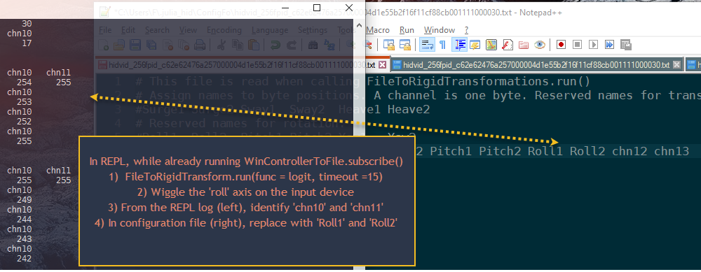
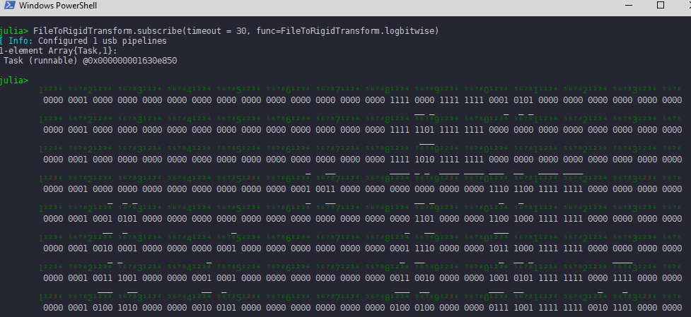

# FileToRigidTransform
This package polls the last recorded state of Usb controllers like spacemice or joysticks. The state is recorded in files by [WinControllerToFile](https://github.com/hustf/WinControllerToFile.jl). The files are updated at state changes, and contain a time stamp.

Currently, the 'transform' part is not actually implemented. The reason being difficulties in interpreting the output from six-dof controllers. Mine seem to intentionally obfuscate their output. Interpreting data from a joystick works fine, though.

The bitwise loggers and compact data extractor may be useful in other projects.

The plan was to integratete the controller(s) state(s) over time, and update corresponding states for rigid transforms. You would assign controller axes to rotations and translations through configuration files for each controller. 

Rotations would be based on quaternions to facilitate screen-aligned rotation axes.

## Installation

## Configuration

## Usage

See example/scriptwork.jl 

## TODO
1) More example configurations
2) Current quaternion logger
3) Current quaternion callback
4) Current transformation logger
5) Current transformation callback
6) doc